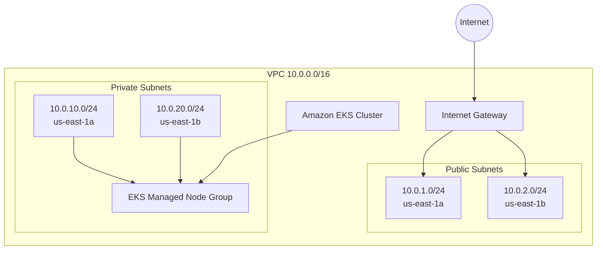

# Modular AWS EKS Infrastructure with Terraform & MiniStack


Infraestrutura como Código (IaC) modular para provisionamento de uma VPC e um cluster Amazon EKS com Terraform.

O projeto também possui um ambiente de desenvolvimento local baseado em MiniStack, permitindo validar a infraestrutura e acessar um cluster Kubernetes compatível com o fluxo EKS sem provisionar recursos reais na AWS.

> Este repositório é um laboratório de infraestrutura e automação. Os módulos podem servir como base para ambientes AWS reais, mas produção exige decisões adicionais de rede, segurança, observabilidade, state remoto e operação.

---

## Arquitetura



O ambiente atual possui:

- VPC `10.0.0.0/16`
- duas Availability Zones
- duas subnets públicas
- duas subnets privadas
- Internet Gateway e rota pública
- cluster EKS
- Managed Node Group
- roles e policies IAM necessárias ao cluster e aos workers

As subnets privadas atualmente não possuem NAT Gateway. Para um ambiente AWS real, a estratégia de egress deve ser definida de acordo com os requisitos da aplicação, por exemplo com NAT Gateway ou VPC Endpoints.

---

## Estrutura do projeto

```text
.
├── .github/
│   └── workflows/
│       └── terraform-ci.yml
├── environments/
│   └── local/
│       ├── .terraform.lock.hcl
│       ├── main.tf
│       ├── outputs.tf
│       └── providers.tf
├── k8s/
│   └── app-demo.yaml
├── modules/
│   ├── eks/
│   │   ├── main.tf
│   │   ├── outputs.tf
│   │   ├── variables.tf
│   │   └── versions.tf
│   └── vpc/
│       ├── main.tf
│       ├── outputs.tf
│       ├── variables.tf
│       └── versions.tf
├── .gitignore
├── .tflint.hcl
├── Makefile
└── README.md
```

---

## Tecnologias

- Terraform
- AWS Provider
- Amazon EKS
- Amazon VPC
- IAM
- Kubernetes
- K3s
- MiniStack
- Docker
- kubectl
- TFLint
- Trivy
- GitHub Actions

---

## Pré-requisitos

Para executar o laboratório local:

- Terraform >= 1.5
- Docker
- kubectl
- GNU Make
- TFLint
- Trivy

Verifique:

```bash
terraform version
docker version
kubectl version --client
make --version
tflint --version
trivy --version
```

---

## Ambiente local

O provider AWS do ambiente `environments/local` utiliza credenciais mock e endpoints locais:

```text
EC2 -> http://localhost:4566
EKS -> http://localhost:4566
IAM -> http://localhost:4566
STS -> http://localhost:4566
```

Nenhuma credencial AWS real é necessária para esse laboratório.

---

## Subindo o MiniStack

```bash
make up
```

O MiniStack fica disponível em:

```text
http://localhost:4566
```

Para verificar:

```bash
docker ps
```

---

## Inicializando o Terraform

```bash
make init
```

Ou diretamente:

```bash
terraform -chdir=environments/local init
```

O lockfile do provider é versionado em:

```text
environments/local/.terraform.lock.hcl
```

Isso mantém a resolução de dependências do provider reproduzível entre execuções.

---

## Planejando a infraestrutura

```bash
make plan
```

---

## Aplicando a infraestrutura

```bash
make apply
```

O ambiente local provisiona os recursos simulados de VPC, IAM e EKS no MiniStack.

Os principais outputs podem ser consultados com:

```bash
terraform -chdir=environments/local output
```

Exemplo:

```text
eks_cluster_endpoint = "https://localhost:16443"
eks_cluster_name     = "local-k8s"
vpc_id               = "vpc-..."
```

---

## Acessando o Kubernetes local

O MiniStack disponibiliza o cluster EKS local através de um container K3s.

Gere um kubeconfig dedicado:

```bash
make kubeconfig
```

O arquivo é salvo por padrão em:

```text
~/.kube/ministack-local-k8s.yaml
```

O Makefile não sobrescreve o kubeconfig principal em `~/.kube/config`.

O endpoint local utilizado é:

```text
https://127.0.0.1:16443
```

O contexto configurado é:

```text
ministack-local-k8s
```

Para validar o acesso:

```bash
make status
```

Ou:

```bash
kubectl \
  --kubeconfig ~/.kube/ministack-local-k8s.yaml \
  get nodes
```

---

## Aplicação Kubernetes de demonstração

O manifesto:

```text
k8s/app-demo.yaml
```

provisiona:

- namespace `demo`
- Deployment `demo-app`
- 2 réplicas do NGINX
- readiness probe
- liveness probe
- requests e limits de CPU/memória
- Service `ClusterIP` na porta `80`

Faça o deploy:

```bash
make deploy-app
```

O target executa o `kubectl apply` e aguarda o rollout do Deployment.

Valide:

```bash
make status
```

Exemplo de estado saudável:

```text
deployment.apps/demo-app   2/2

pod/demo-app-...           1/1   Running
pod/demo-app-...           1/1   Running

service/demo-service       ClusterIP   ...   80/TCP
```

---

## Testando a aplicação

Faça um port-forward:

```bash
kubectl \
  --kubeconfig ~/.kube/ministack-local-k8s.yaml \
  port-forward \
  -n demo \
  svc/demo-service \
  8080:80
```

Em outro terminal:

```bash
curl -I http://localhost:8080
```

Resposta esperada:

```text
HTTP/1.1 200 OK
Server: nginx/1.27.5
```

---

## Comandos disponíveis

```bash
make up
make down

make init
make plan
make apply
make destroy

make kubeconfig
make deploy-app
make status

make fmt
make fmt-check
make lint
make validate
make test
```

### Terraform

`make init`

Inicializa providers e dependências Terraform.

`make plan`

Gera o execution plan.

`make apply`

Aplica a infraestrutura local.

`make destroy`

Remove os recursos gerenciados pelo Terraform.

### Kubernetes

`make kubeconfig`

Obtém o kubeconfig do cluster K3s criado pelo MiniStack e gera um arquivo dedicado.

`make deploy-app`

Aplica o workload de demonstração e aguarda o rollout.

`make status`

Exibe node, Deployment, Pods e Service do ambiente de demonstração.

### Qualidade

`make fmt`

Formata os arquivos Terraform.

`make fmt-check`

Verifica formatação sem modificar os arquivos.

`make lint`

Executa TFLint e Trivy.

`make validate`

Inicializa Terraform sem backend e executa `terraform validate`.

`make test`

Executa as validações de formatação, lint e Terraform.

---

## CI com GitHub Actions

O workflow:

```text
.github/workflows/terraform-ci.yml
```

é executado em pushes e Pull Requests direcionados para `main`.

A pipeline valida:

```text
terraform fmt -check -recursive
        |
        v
tflint --init
        |
        v
tflint --recursive
        |
        v
trivy config .
        |
        v
terraform init -backend=false
        |
        v
terraform validate
```

O Trivy atualmente funciona como análise informativa e não bloqueia a pipeline em caso de findings.

---

## Módulo VPC

O módulo `modules/vpc` cria:

- VPC
- Internet Gateway
- public subnets
- private subnets
- public route table
- private route table
- route table associations
- tags Kubernetes para descoberta de subnets

Exemplo:

```hcl
module "vpc" {
  source = "../../modules/vpc"

  environment        = "local"
  cidr_block         = "10.0.0.0/16"
  availability_zones = ["us-east-1a", "us-east-1b"]

  public_subnets = [
    "10.0.1.0/24",
    "10.0.2.0/24"
  ]

  private_subnets = [
    "10.0.10.0/24",
    "10.0.20.0/24"
  ]
}
```

---

## Módulo EKS

O módulo `modules/eks` cria:

- IAM Role do control plane
- Amazon EKS Cluster
- IAM Role dos nodes
- Managed Node Group
- policies IAM necessárias aos workers

Exemplo:

```hcl
module "eks" {
  source = "../../modules/eks"

  cluster_name   = "local-k8s"
  subnet_ids     = module.vpc.private_subnet_ids
  desired_nodes  = 2
  min_nodes      = 1
  max_nodes      = 3
  instance_types = ["t3.medium"]

  depends_on = [module.vpc]
}
```

---

## Validação realizada

O ambiente local foi validado com:

```text
Terraform configuration valid
Infrastructure refresh: 0 added, 0 changed, 0 destroyed
Kubernetes node: Ready
Deployment: 2/2 available
Pods: 2/2 Running
Service: ClusterIP
HTTP application test: 200 OK
```

Também foi validada a execução repetida de `make deploy-app`, mantendo os recursos sem recriações desnecessárias.

---

## Uso em AWS real

Os módulos foram estruturados para separar componentes de VPC e EKS, mas este repositório não deve ser interpretado como uma arquitetura de produção completa.

Antes de utilizar uma implementação equivalente em produção, considere pelo menos:

- backend remoto e locking para Terraform state
- estratégia de NAT Gateway ou VPC Endpoints
- criptografia e gestão de secrets
- controle de acesso ao cluster
- IAM Roles for Service Accounts ou EKS Pod Identity
- observabilidade e logging
- add-ons do EKS
- políticas de backup e disaster recovery
- estratégia de atualização do Kubernetes
- controles adicionais de segurança e compliance

---

## Destruindo o ambiente

Para remover os recursos controlados pelo Terraform:

```bash
make destroy
```

Para remover o container do MiniStack:

```bash
make down
```

---

## Objetivo do projeto

Este projeto demonstra práticas de:

- Infrastructure as Code
- modularização Terraform
- automação com Make
- validação local de infraestrutura AWS
- Kubernetes
- CI para IaC
- lint e análise de segurança
- versionamento reproduzível de providers
- workflow baseado em feature branches e Pull Requests
