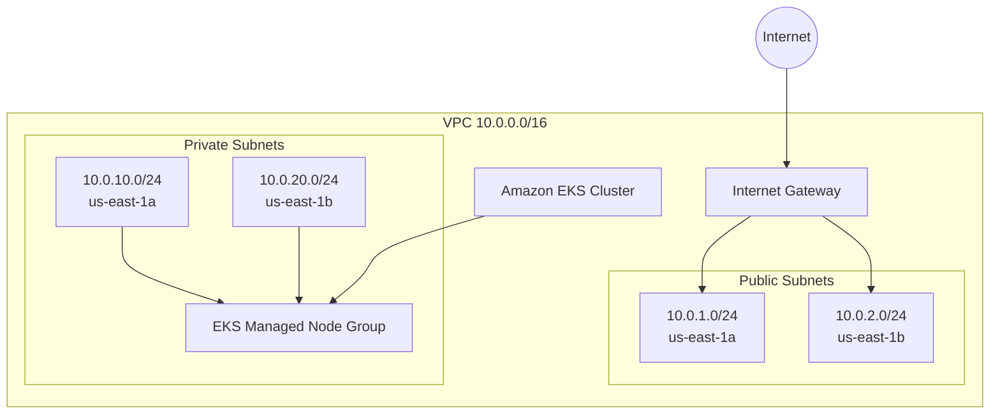

# Infraestrutura Modular AWS EKS com Terraform e MiniStack


Infraestrutura como Código (IaC) modular para provisionamento de uma VPC e um cluster Amazon EKS com Terraform.

O projeto também possui um ambiente de desenvolvimento local baseado em MiniStack, permitindo validar a infraestrutura e acessar um cluster Kubernetes compatível com o fluxo EKS sem provisionar recursos reais na AWS.

Além da validação local com MiniStack, os módulos VPC e EKS possuem testes nativos do Terraform utilizando providers mockados, permitindo validar a lógica da infraestrutura sem credenciais AWS e sem criação de recursos reais.

> Este repositório é um laboratório de infraestrutura e automação. Os módulos podem servir como base para ambientes AWS reais, mas produção exige decisões adicionais de rede, segurança, observabilidade, state remoto e operação.

---

## Arquitetura



O ambiente atual possui:

- VPC `10.0.0.0/16`
- duas Availability Zones
- duas subnets públicas
- duas subnets privadas
- Internet Gateway e rota pública
- cluster EKS
- Managed Node Group
- roles e policies IAM necessárias ao cluster e aos workers

As subnets privadas atualmente não possuem NAT Gateway.

Para um ambiente AWS real, a estratégia de egress deve ser definida de acordo com os requisitos da aplicação, por exemplo com NAT Gateway ou VPC Endpoints.

---

## Estratégia de validação

O projeto utiliza diferentes camadas de validação:

```text
                    Terraform Modules
                   /                 \
                VPC                   EKS
                 |                     |
                 +----------+----------+
                            |
               Terraform Native Tests
                 Mocked AWS Provider
                            |
                 No AWS provisioning
                            |
               +------------+------------+
               |                         |
        MiniStack / K3s             GitHub Actions
        Local integration              CI
```

A abordagem permite validar diferentes aspectos da infraestrutura:

- **Terraform native tests** validam a lógica dos módulos sem provisionar recursos.
- **MiniStack** simula APIs AWS utilizadas pelo ambiente local.
- **K3s** fornece um cluster Kubernetes local para validação de workloads.
- **TFLint** executa análise estática do Terraform.
- **Trivy** executa análise de segurança da infraestrutura e manifests Kubernetes.
- **GitHub Actions** executa as validações automaticamente em pushes e Pull Requests.

---

## Estrutura do projeto

```text
.
├── .github/
│   └── workflows/
│       └── terraform-ci.yml
├── environments/
│   └── local/
│       ├── .terraform.lock.hcl
│       ├── main.tf
│       ├── outputs.tf
│       └── providers.tf
├── k8s/
│   └── app-demo.yaml
├── modules/
│   ├── eks/
│   │   ├── tests/
│   │   │   └── eks.tftest.hcl
│   │   ├── .terraform.lock.hcl
│   │   ├── main.tf
│   │   ├── outputs.tf
│   │   ├── variables.tf
│   │   └── versions.tf
│   └── vpc/
│       ├── tests/
│       │   └── vpc.tftest.hcl
│       ├── .terraform.lock.hcl
│       ├── main.tf
│       ├── outputs.tf
│       ├── variables.tf
│       └── versions.tf
├── .gitignore
├── .tflint.hcl
├── Makefile
└── README.md
```

---

## Tecnologias

- Terraform
- AWS Provider
- Amazon EKS
- Amazon VPC
- IAM
- Kubernetes
- K3s
- MiniStack
- Docker
- kubectl
- GNU Make
- TFLint
- Trivy
- GitHub Actions

---

## Pré-requisitos

Para executar o laboratório local e toda a suíte de testes:

- Terraform >= 1.7
- Docker
- kubectl
- GNU Make
- TFLint
- Trivy

Verifique:

```bash
terraform version
docker version
kubectl version --client
make --version
tflint --version
trivy --version
```

Terraform 1.7 ou superior é utilizado para permitir a execução dos testes nativos com providers mockados.

---

## Ambiente local

O provider AWS do ambiente `environments/local` utiliza credenciais mock e endpoints locais:

```text
EC2 -> http://localhost:4566
EKS -> http://localhost:4566
IAM -> http://localhost:4566
STS -> http://localhost:4566
```

Nenhuma credencial AWS real é necessária para esse laboratório.

---

## Subindo o MiniStack

```bash
make up
```

O MiniStack fica disponível em:

```text
http://localhost:4566
```

Para verificar:

```bash
docker ps
```

---

## Inicializando o Terraform

```bash
make init
```

Ou diretamente:

```bash
terraform -chdir=environments/local init
```

O lockfile do provider é versionado em:

```text
environments/local/.terraform.lock.hcl
```

Isso mantém a resolução de dependências do provider reproduzível entre execuções.

Os módulos VPC e EKS também possuem lockfiles próprios para tornar reproduzível a execução dos testes nativos:

```text
modules/vpc/.terraform.lock.hcl
modules/eks/.terraform.lock.hcl
```

---

## Planejando a infraestrutura

```bash
make plan
```

---

## Aplicando a infraestrutura

```bash
make apply
```

O ambiente local provisiona os recursos simulados de VPC, IAM e EKS no MiniStack.

Os principais outputs podem ser consultados com:

```bash
terraform -chdir=environments/local output
```

Exemplo:

```text
eks_cluster_endpoint = "https://localhost:16443"
eks_cluster_name     = "local-k8s"
vpc_id               = "vpc-..."
```

---

## Acessando o Kubernetes local

O MiniStack disponibiliza o cluster EKS local através de um container K3s.

Gere um kubeconfig dedicado:

```bash
make kubeconfig
```

O arquivo é salvo por padrão em:

```text
~/.kube/ministack-local-k8s.yaml
```

O Makefile não sobrescreve o kubeconfig principal em:

```text
~/.kube/config
```

O endpoint local utilizado é:

```text
https://127.0.0.1:16443
```

O contexto configurado é:

```text
ministack-local-k8s
```

Para validar o acesso:

```bash
make status
```

Ou:

```bash
kubectl \
  --kubeconfig ~/.kube/ministack-local-k8s.yaml \
  get nodes
```

---

## Aplicação Kubernetes de demonstração

O manifesto:

```text
k8s/app-demo.yaml
```

provisiona:

- namespace `demo`
- Deployment `demo-app`
- 2 réplicas
- NGINX unprivileged
- readiness probe
- liveness probe
- requests e limits de CPU/memória
- Service `ClusterIP` na porta `80`

O workload também utiliza controles adicionais de segurança:

- execução como usuário não root
- `allowPrivilegeEscalation: false`
- filesystem root read-only
- remoção das Linux capabilities
- seccomp `RuntimeDefault`
- service account token não montado automaticamente

Faça o deploy:

```bash
make deploy-app
```

O target executa o `kubectl apply` e aguarda o rollout do Deployment.

Valide:

```bash
make status
```

Exemplo de estado saudável:

```text
deployment.apps/demo-app   2/2

pod/demo-app-...           1/1   Running
pod/demo-app-...           1/1   Running

service/demo-service       ClusterIP   ...   80/TCP
```

---

## Testando a aplicação

Faça um port-forward:

```bash
kubectl \
  --kubeconfig ~/.kube/ministack-local-k8s.yaml \
  port-forward \
  -n demo \
  svc/demo-service \
  8080:80
```

Em outro terminal:

```bash
curl -I http://localhost:8080
```

Resposta esperada:

```text
HTTP/1.1 200 OK
```

---

## Comandos disponíveis

```bash
make up
make down

make init
make plan
make apply
make destroy

make kubeconfig
make deploy-app
make status

make fmt
make fmt-check
make lint
make validate
make test-unit
make test
```

### Terraform

`make init`

Inicializa providers e dependências Terraform.

`make plan`

Gera o execution plan.

`make apply`

Aplica a infraestrutura local.

`make destroy`

Remove os recursos gerenciados pelo Terraform.

### Kubernetes

`make kubeconfig`

Obtém o kubeconfig do cluster K3s criado pelo MiniStack e gera um arquivo dedicado.

`make deploy-app`

Aplica o workload de demonstração e aguarda o rollout.

`make status`

Exibe node, Deployment, Pods e Service do ambiente de demonstração.

### Qualidade

`make fmt`

Formata os arquivos Terraform.

`make fmt-check`

Verifica formatação sem modificar os arquivos.

`make lint`

Executa TFLint e Trivy.

`make validate`

Inicializa Terraform sem backend e executa:

```bash
terraform validate
```

`make test-unit`

Executa os testes nativos dos módulos VPC e EKS utilizando providers AWS mockados.

Esses testes validam a lógica dos módulos sem credenciais AWS e sem provisionar recursos reais.

`make test`

Executa o conjunto completo de validações locais:

- Terraform format check
- TFLint
- Trivy
- Terraform validate
- testes nativos do módulo VPC
- testes nativos do módulo EKS

---

## Testes nativos do Terraform

Os módulos VPC e EKS possuem testes nativos do Terraform utilizando providers mockados.

Isso permite validar a lógica da infraestrutura sem:

- utilizar credenciais AWS
- acessar uma conta AWS
- criar VPCs reais
- criar clusters EKS reais
- criar instâncias EC2
- gerar custos de provisionamento

Execute todos os testes de módulos com:

```bash
make test-unit
```

O fluxo executado é equivalente a:

```bash
terraform -chdir=modules/vpc init \
  -backend=false \
  -input=false \
  -lockfile=readonly

terraform -chdir=modules/vpc test

terraform -chdir=modules/eks init \
  -backend=false \
  -input=false \
  -lockfile=readonly

terraform -chdir=modules/eks test
```

Os testes utilizam:

```hcl
mock_provider "aws" {}
```

e executam planos Terraform para validar os recursos e valores produzidos pelos módulos.

### Testes do módulo VPC

O módulo VPC possui testes para:

- criação da topologia padrão
- criação de duas subnets públicas
- criação de duas subnets privadas
- distribuição das subnets entre Availability Zones
- atribuição de IP público nas subnets públicas
- topologia customizada com três Availability Zones
- topologia customizada com três subnets públicas
- topologia customizada com três subnets privadas

Resultado atual:

```text
tests/vpc.tftest.hcl... in progress
  run "creates_default_vpc_topology"... pass
  run "supports_custom_three_az_topology"... pass
tests/vpc.tftest.hcl... pass

Success! 2 passed, 0 failed.
```

### Testes do módulo EKS

O módulo EKS possui testes para:

- nome do cluster
- utilização das subnets configuradas
- nome do Managed Node Group
- quantidade padrão de nodes
- valores `min`, `desired` e `max`
- configuração customizada de scaling
- tipos de instância customizados
- policy `AmazonEKSClusterPolicy`
- policy `AmazonEKSWorkerNodePolicy`
- policy `AmazonEKS_CNI_Policy`
- policy `AmazonEC2ContainerRegistryReadOnly`

Resultado atual:

```text
tests/eks.tftest.hcl... in progress
  run "creates_default_eks_topology"... pass
  run "supports_custom_node_group_configuration"... pass
  run "attaches_required_managed_policies"... pass
tests/eks.tftest.hcl... pass

Success! 3 passed, 0 failed.
```

### Resultado consolidado

```text
VPC: 2 passed
EKS: 3 passed

Total: 5 passed, 0 failed
```

Essa camada de testes permite evoluir os módulos gradualmente e validar alterações de infraestrutura antes de qualquer provisionamento real.

---

## CI com GitHub Actions

O workflow:

```text
.github/workflows/terraform-ci.yml
```

é executado em pushes e Pull Requests direcionados para `main`.

A pipeline executa:

```text
terraform fmt -check -recursive
        |
        v
tflint --init
        |
        v
tflint --recursive
        |
        v
trivy config .
        |
        v
terraform init -backend=false
        |
        v
terraform validate
        |
        v
make test-unit
        |
        +--> terraform test - modules/vpc
        |
        +--> terraform test - modules/eks
```

Os testes de módulos são executados através de:

```bash
make test-unit
```

O mesmo comando é utilizado localmente e na pipeline, reduzindo diferenças entre a validação executada pelo desenvolvedor e a validação executada no CI.

O Trivy atualmente funciona como análise informativa e não bloqueia a pipeline em caso de findings.

O objetivo futuro é tratar os findings arquiteturais existentes e posteriormente transformar findings de maior severidade em security gates do CI.

---

## Módulo VPC

O módulo:

```text
modules/vpc
```

cria:

- VPC
- Internet Gateway
- public subnets
- private subnets
- public route table
- private route table
- route table associations
- tags Kubernetes para descoberta de subnets

Exemplo:

```hcl
module "vpc" {
  source = "../../modules/vpc"

  environment        = "local"
  cidr_block         = "10.0.0.0/16"
  availability_zones = ["us-east-1a", "us-east-1b"]

  public_subnets = [
    "10.0.1.0/24",
    "10.0.2.0/24"
  ]

  private_subnets = [
    "10.0.10.0/24",
    "10.0.20.0/24"
  ]
}
```

---

## Módulo EKS

O módulo:

```text
modules/eks
```

cria:

- IAM Role do control plane
- Amazon EKS Cluster
- IAM Role dos nodes
- Managed Node Group
- policies IAM necessárias aos workers
- endpoint da API privado por padrão
- validação de CIDRs quando o endpoint público é habilitado
- logs do control plane habilitados por padrão

Exemplo:

```hcl
module "eks" {
  source = "../../modules/eks"

  cluster_name   = "local-k8s"
  subnet_ids     = module.vpc.private_subnet_ids
  desired_nodes  = 2
  min_nodes      = 1
  max_nodes      = 3
  instance_types = ["t3.medium"]

  endpoint_private_access = true
  endpoint_public_access  = false

  depends_on = [module.vpc]
}
```

Para permitir acesso público administrativo, informe explicitamente CIDRs restritos:

```hcl
endpoint_private_access = true
endpoint_public_access  = true
public_access_cidrs     = ["203.0.113.10/32"]
```

O módulo rejeita `0.0.0.0/0` e `::/0` no endpoint público. Os cinco tipos de logs do control plane são enviados ao CloudWatch por padrão e podem ser ajustados por `enabled_cluster_log_types`.

---

## Validação realizada

O ambiente foi validado com:

```text
Terraform configuration valid

Terraform native tests:
  VPC: 2/2 passed
  EKS: 3/3 passed
  Total: 5 passed, 0 failed

Infrastructure refresh:
  0 added
  0 changed
  0 destroyed

Kubernetes node:
  Ready

Deployment:
  2/2 available

Pods:
  2/2 Running

Service:
  ClusterIP

Container runtime:
  non-root

HTTP application test:
  HTTP/1.1 200 OK
```

Também foi validada a execução repetida de:

```bash
make deploy-app
```

mantendo os recursos sem recriações desnecessárias.

---

## Análise de segurança

O projeto utiliza Trivy para análise estática de segurança da infraestrutura e dos manifests Kubernetes:

```bash
trivy config .
```

Atualmente existem findings conhecidos relacionados principalmente à arquitetura de produção, incluindo:

- EKS control plane logging
- configuração de acesso público ao endpoint EKS
- configuração de encryption do cluster
- VPC Flow Logs
- atribuição automática de IP público em public subnets
- políticas adicionais de segurança do workload Kubernetes

Esses findings são tratados como itens de evolução arquitetural e não são ocultados da pipeline.

O objetivo é reduzir progressivamente os findings conforme os módulos recebem controles adicionais de produção.

---

## Uso em AWS real

Os módulos foram estruturados para separar componentes de VPC e EKS e permitir evolução para ambientes AWS reais.

O ambiente local e os testes mockados existem para reduzir a necessidade de provisionamento durante o desenvolvimento, mas não substituem completamente testes de integração com serviços AWS reais.

Antes de utilizar uma implementação equivalente em produção, considere pelo menos:

- backend remoto para Terraform state
- state locking
- estratégia de NAT Gateway ou VPC Endpoints
- VPC Flow Logs
- controle de acesso ao endpoint EKS
- EKS control plane logging
- gestão de secrets e criptografia
- EKS Access Entries
- EKS Pod Identity ou mecanismo equivalente de workload identity
- observabilidade
- add-ons gerenciados do EKS
- Network Policies
- Pod Security Standards
- políticas de backup
- disaster recovery
- estratégia de atualização do Kubernetes
- atualização controlada dos Managed Node Groups
- controles adicionais de segurança e compliance

A estratégia planejada é manter os mesmos módulos reutilizáveis para:

```text
modules/
├── vpc
└── eks
```

e consumir esses módulos em ambientes diferentes:

```text
                 modules/
              ┌──────┴──────┐
              │             │
             vpc           eks
              │             │
              └──────┬──────┘
                     │
          ┌──────────┴──────────┐
          │                     │
 environments/local     environments/aws
          │                     │
    MiniStack / K3s          AWS real
    local validation        production
```

O objetivo é evitar a criação de uma implementação específica para laboratório e outra completamente diferente para produção.

---

## Destruindo o ambiente

Para remover os recursos controlados pelo Terraform:

```bash
make destroy
```

Para remover o container do MiniStack:

```bash
make down
```

---

## Objetivo do projeto

Este projeto demonstra práticas de:

- Infrastructure as Code
- modularização Terraform
- automação com GNU Make
- validação local de infraestrutura AWS
- Kubernetes
- Amazon EKS
- CI para IaC
- lint de Terraform
- análise de segurança de infraestrutura
- versionamento reproduzível de providers
- testes nativos do Terraform
- mocking do AWS Provider
- validação automatizada de módulos Terraform
- testes de infraestrutura sem provisionamento AWS
- Kubernetes workload validation
- workflow baseado em feature branches e Pull Requests

O objetivo de longo prazo é evoluir o projeto para uma base de infraestrutura próxima de um cenário production-ready, mantendo a possibilidade de executar a maior parte das validações localmente e sem custos de provisionamento na AWS.
